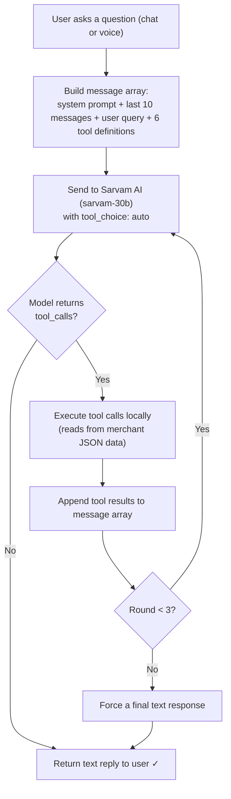

# Paytm Merchant Copilot

An AI-powered merchant intelligence dashboard and conversational copilot built for small and medium businesses on Paytm. Built at the **Paytm x Sarvam AI Hackathon (2026)**.

## The Problem

Small business owners on Paytm don't have time to dig through dashboards, spreadsheets, or reports to understand how their business is performing. They need quick, plain-language answers to questions like:

- "How are my sales compared to last month?"
- "Which days perform the best?"
- "What should I focus on to grow?"
- "Are my payouts delayed?"

## What We Built

A merchant-focused AI assistant and transaction analytics dashboard that plugs into the existing Paytm for Business ecosystem. Merchants can either browse rich visual analytics or simply **ask questions in natural language** (text or voice, in English or Hindi) and get actionable business insights.

### Key Features

- **AI Copilot Chat** : Conversational interface powered by Sarvam AI (sarvam-30b) with agentic function-calling. Answers business questions grounded in real transaction data.
- **Voice Assistant** : Speak questions in English or Hindi using Sarvam's STT/TTS APIs. Designed for merchants who prefer voice over typing.
- **Revenue & Forecasting** : 30-day revenue trends with a 7-day predictive forecast based on rolling baseline averages.
- **Peak Hours Analysis** : Hourly transaction heatmap showing when the business is busiest.
- **Customer Visit Patterns** : Segmentation of customers into frequency groups (Loyal, Frequent, Occasional, Single Visit) with repeat rate tracking.
- **Settlement Intelligence** : Real-time payout ledger with delay risk predictions and risk scoring.
- **Daily & Monthly Recaps** : AI-generated operational reports summarizing key metrics and recommending growth actions.
- **AI Insight Cards** : Proactive recommendations (loyalty campaigns, peak-hour staffing, settlement delay alerts) surfaced on the overview dashboard.

## How the Agentic Loop Works

The core of this project is an **agentic AI loop** : the LLM doesn't just generate text, it reasons about what data it needs and autonomously fetches it before answering.

### The Loop (up to 3 rounds)



### Available Tools

The model can call these tools during a conversation to pull merchant-specific data:

| Tool | What it returns |
|------|----------------|
| `get_revenue_trend` | Daily revenue + order count, filterable by month or date range |
| `get_peak_hours` | Transaction count and revenue for each hour (0–23 IST) |
| `get_customer_segments` | Unique customers, new/returning/frequent/high-value breakdown |
| `get_payment_breakdown` | Revenue split by payment mode (UPI, Card, etc.) |
| `get_settlement_summary` | Amounts settled, pending, delayed, or failed |
| `get_recap` | Daily or monthly business summary with top metrics |

### Why This Matters

Traditional dashboard chatbots inject the *entire* dataset into the prompt context. Our approach is different:

1. **The model decides what data it needs** : if you ask about peak hours, it only fetches hourly stats, not your entire transaction history.
2. **Multi-step reasoning** : the model can call multiple tools in sequence (e.g., get revenue trend first, then customer segments) to build a comprehensive answer.
3. **Bounded execution** : max 3 tool rounds prevents infinite loops while allowing complex multi-data-point answers.

### Voice Flow

For voice interactions, the flow extends to:


The system prompt adapts for voice mode (no markdown formatting, conversational prose) and supports both English and Hindi.

## Architecture

```
Next.js 16 App Router
├── /src/app/page.tsx              - Server component that loads merchant data
├── /src/components/               - Client-side dashboard UI (Recharts, Tailwind)
├── /src/app/api/
│   ├── /chat/route.ts             - Agentic chat endpoint (Sarvam sarvam-30b)
│   ├── /voice/stt/route.ts        - Speech-to-text via Sarvam
│   ├── /voice/tts/route.ts        - Text-to-speech via Sarvam
│   └── /recap/route.ts            - Daily recap generation
├── /src/lib/
│   ├── /analytics/                - Pure analytics functions (revenue, peaks, customers, settlements, forecast, recaps)
│   ├── /agent/agentTools.ts       - Tool definitions + executor for the agentic loop
│   ├── /agent/dataUtils.ts        - Data retrieval functions that tools call
│   └── data.ts                    - Data loading and orchestration
└── /data/                         - Mock merchant/transaction/settlement JSON
```

## Tech Stack

| Layer | Technology |
|-------|-----------|
| Framework | Next.js 16 (App Router, React 19) |
| AI | Sarvam AI : sarvam-30b (chat + function calling) |
| Voice | Sarvam STT & TTS APIs |
| Charts | Recharts |
| Styling | Tailwind CSS 4 |
| Deployment | Vercel |

## Running Locally

```bash
cd paytm-merchant-copilot
npm install
```

Create a `.env.local` file:

```env
SARVAM_API_KEY=your_sarvam_api_key
```

Then start the dev server:

```bash
npm run dev
```

Open [http://localhost:3000](http://localhost:3000).

> **Note:** The Sarvam AI API keys were provisioned for the hackathon event only. Without a valid key, the AI copilot chat and voice features will not function. The dashboard analytics and visualizations still render from the local mock data.

## Hackathon Context

**Event:** Paytm x Sarvam AI Hackathon, June 2026

**Theme chosen:** *AI for Small Business* : AI tools that help India's millions of small and medium businesses grow, operate, and scale more efficiently.

**Idea:** Instead of making merchants parse complex dashboards, give them a conversational AI copilot that understands their transaction data and speaks their language literally (Hindi + English voice support). Designed to integrate seamlessly with the existing Paytm for Business merchant dashboard.

## Team

- [Alvin Pauly](https://github.com/avnpl)
- [Kaartik Nayak](https://github.com/kaartik2611)

## License

This project was built as a hackathon prototype and is not affiliated with or endorsed by Paytm or Sarvam AI.
